# 溢狗之家博客网站前端

## 项目简介

本仓库为溢狗之家博客网站的前端代码仓库，后端代码仓库[在这里](https://github.com/YYgx2020/yg_server.git)。

本站点部分页面适配移动端，页面风格仿照稀土掘金，pc 端可以对文章进行创建、发布、展示、更新、删除。

由于本站点当前服务和内容较少，因此前端暂不设置注册功能，但后端写有注册接口，可以使用 Apifox 测试工具生成用户。

### 注册账户步骤：

1. 填写邮箱获取验证码

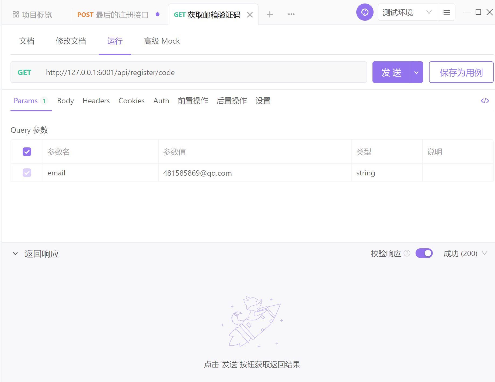

2. 使用注册接口发送请求注册用户

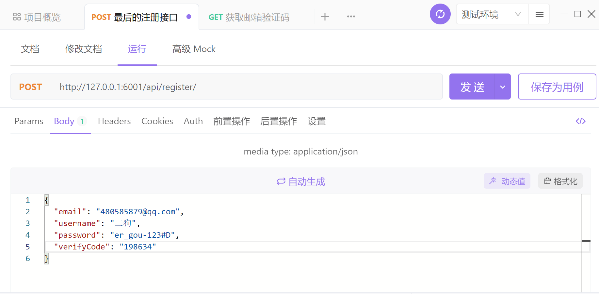

## 项目预览

### 网址

[https://www.lianghongyi.com](https://www.lianghongyi.com)

### 移动端

个人中心-我的文章

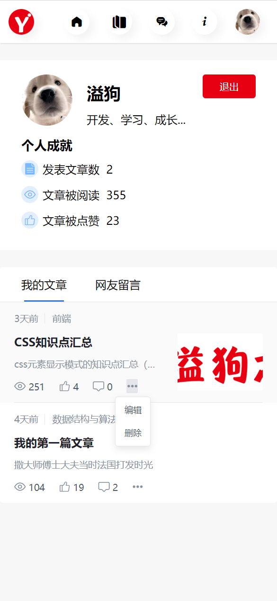

个人中心-网友留言-最新

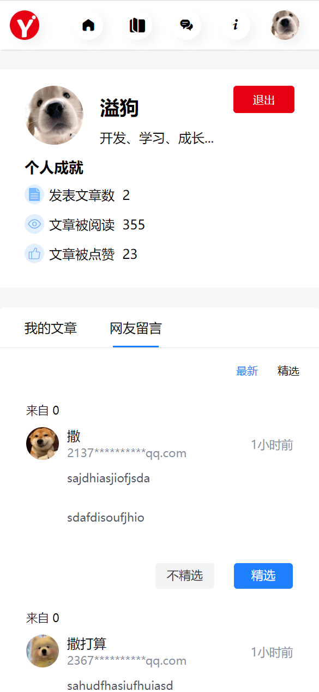

个人中心-网友留言-精选

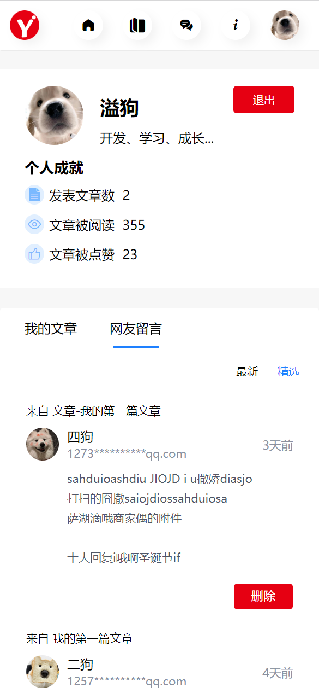

### PC端

首页


个人中心

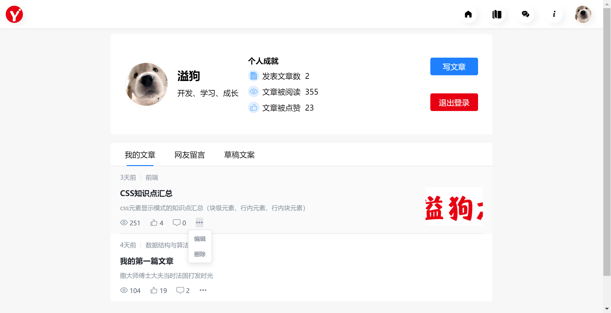

写 / 编辑文章

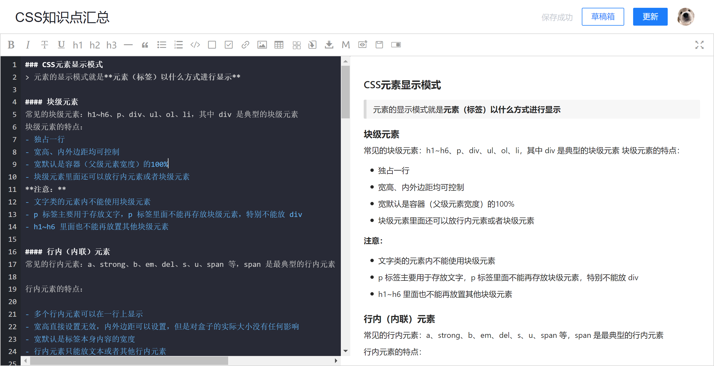

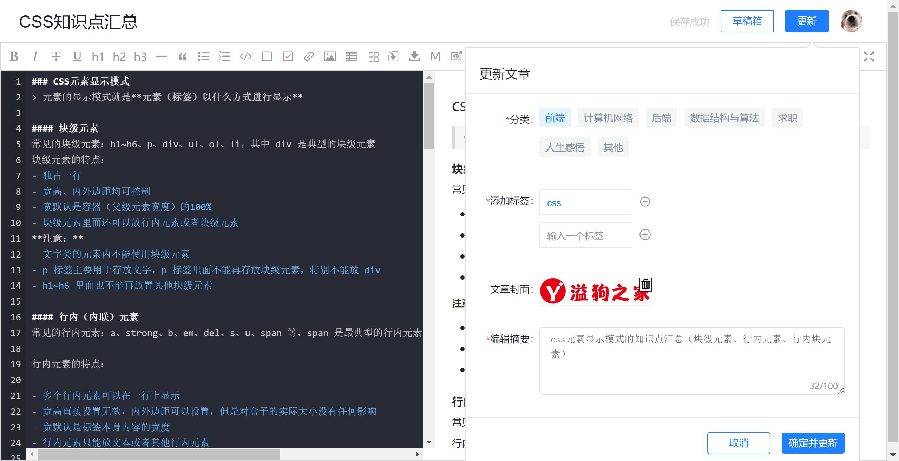

查看网友留言-最新

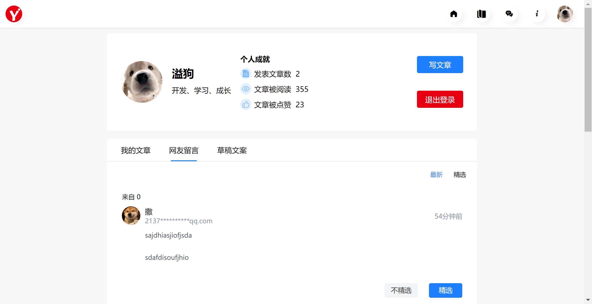

查看网友留言-精选

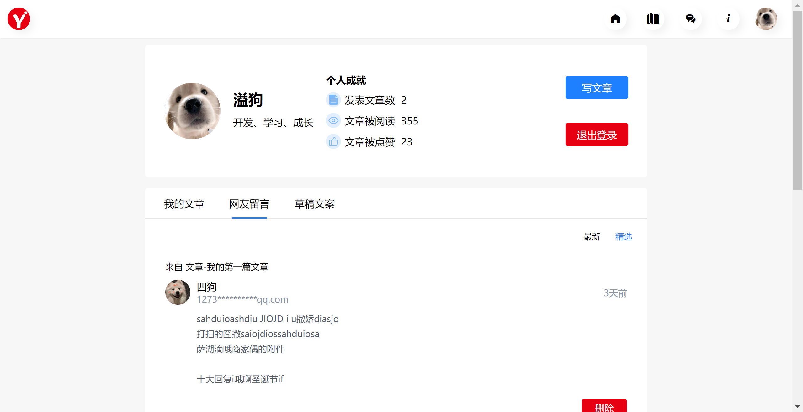

查看草稿文案

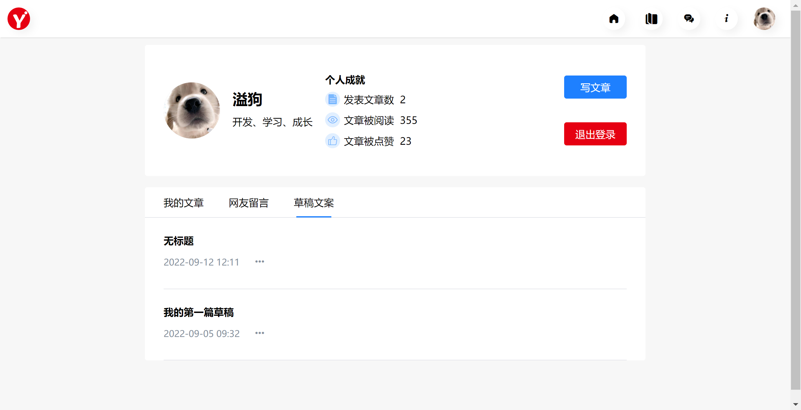


## 技术栈

- 主要技术栈为 vue2，部分使用 element-ui

- markdown 编辑器使用的是 [vue-meditor](https://zhaoxuhui1122.github.io/vue-markdown-docs/) 插件


## 使用

### 安装

```
npm install
```

### 运行

```
npm run serve
```

### 打包

```
npm run build
```


